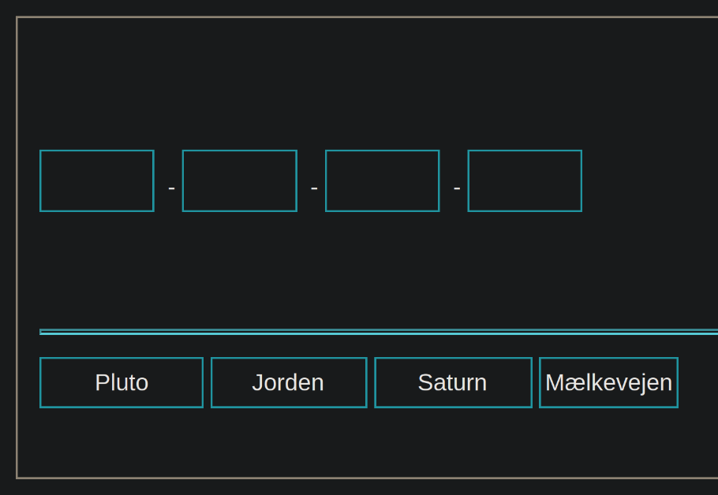
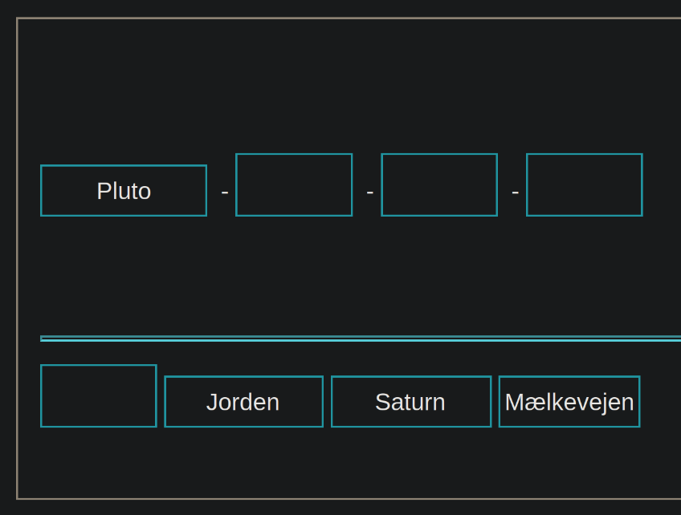
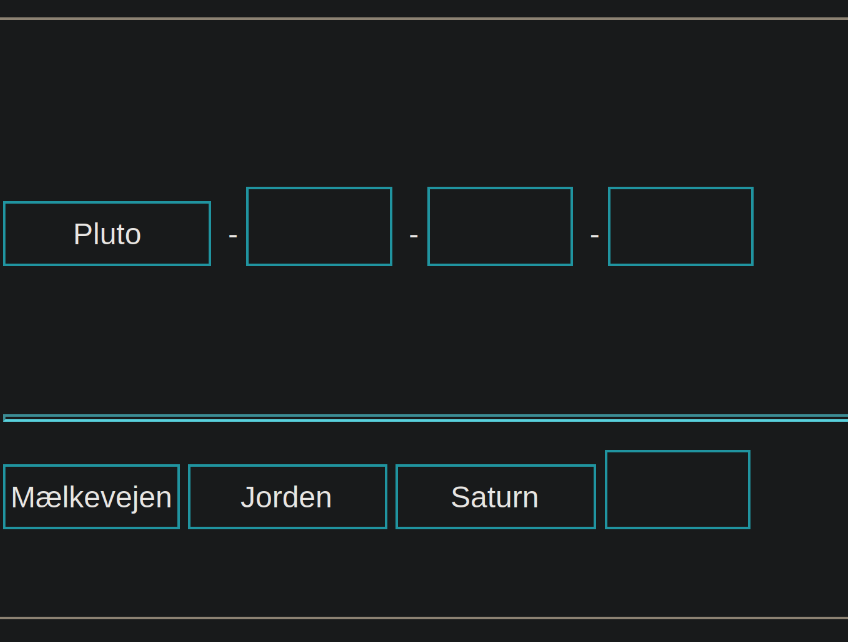

# empty-space-sorting-algorithm

A silly sorting algorithm that sorts spaces :3

I got the idea for this sorting algorithm from a test I took online, after dragging an answer to its space I found myself sorting the answers to the left like so:





## How it works
Given an input like:

```
hello-X-world
```

We start indexing from right to left looking for a non-empty space:

```
          2
hello-X-world
```

Index 2 is non-empty so now we need to look for an empty space to swap it with, so we start indexing from left to right:

```
          2
hello-X-world
  0   1
```

Space 1 is empty so we swap it with space 2:

```
            2
hello-world-X
  0     1
```

We continue indexing from right to left until both indexes is equal to eachother:

```
        1   2
hello-world-X
  0     1
```

Both indexes are equal to eachother so now we have finished sorting

## Generating input
Use the script `input-generator.py` to generate input with x amount of spaces

To generate input with 100 spaces you would run:

```
python3 input-generator.py 100
```

A file called `input-100` will then be created and the input will be written to it

## Sorting input
The sorting program is built in Rust, you will need   `cargo` to build it, you can install it from https://rustup.rs

Build the sorting program with:

```
cargo build --release
```

Then pass input to sort, for example `input-100`:

```
./target/release/empty-space-sorting-algorithm input-100
```